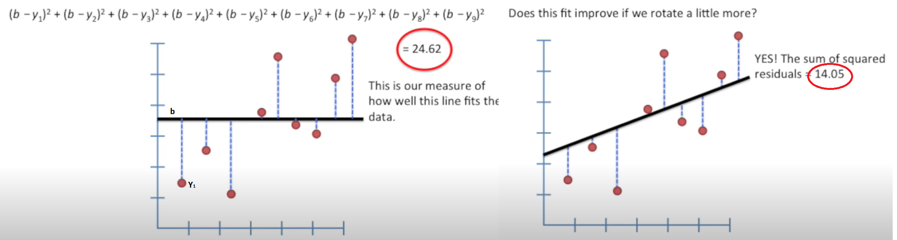
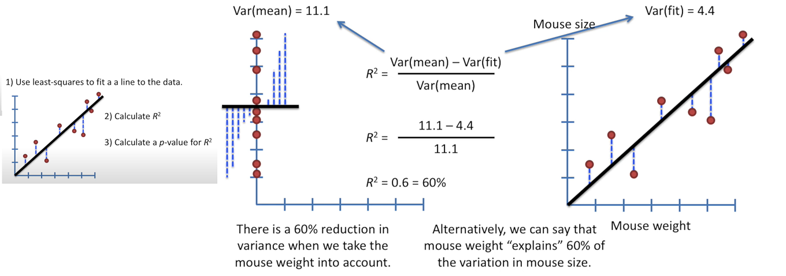
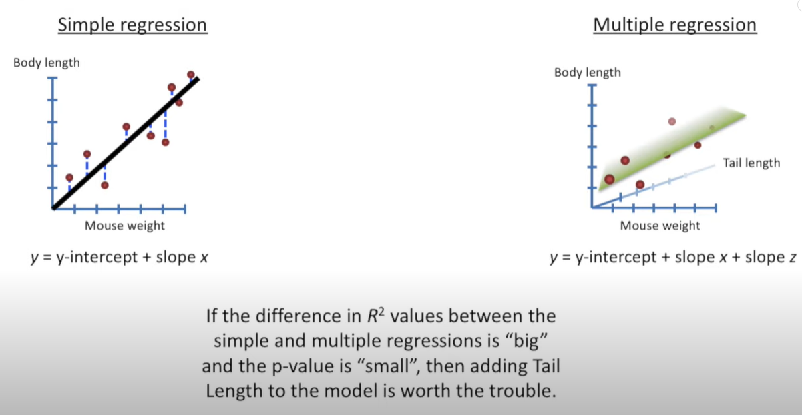
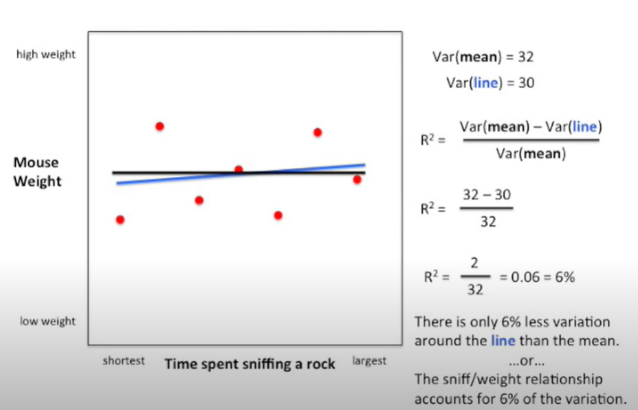

# ML Theorie

## Linear Regression and Linear Models

Linear Regression is a statistical approach in machine learning that predicts a continuous outcome based on the linear relationship between the dependent and independent variables.  
Linear Models, including Linear Regression, use a formula involving weighted input features to make predictions, offering simplicity and ease of interpretation.

`continuous outcome`: Numerical values that can take on any value within a range. House Prices, Temperature Forecasting, Stock Prices.  

`dependent variable`: A dependent variable is the outcome that is being measured and analyzed, typically influenced or predicted by one or more independent variables. 

`Independent variable`; 
Independent variables are the factors or inputs that are manipulated or observed to determine their effect on the dependent variable in an experiment or statistical analys.

`residuals`: 
Residuals are the differences between the observed values and the values predicted by machine learning model.

`R-square`: Quantifies the percentage of the variance in the dependent variable that is predictable from the independent variables in a regression model. It provides a measure of how well the model's predictions approximate the real data points, with a value ranging from 0 to 1.
 	
 `t-tests`: 
A t-test is a statistical test used to compare the means of two groups to determine if there is a significant difference between them. It's commonly used in hypothesis testing to assess whether any observed differences in sample means are due to chance or reflect true differences in the populations.

`ANOVA`: Analysis of Variance, is a statistical method used to compare the means of three or more groups to determine if there are any statistically significant differences among them. It generalizes the t-test to more than two groups, analyzing the variance within and between groups to assess whether any observed differences are due to chance or reflect true differences in the populations.

### The Main Ideas of Fitting a Line to Data

Fitting a line to data, commonly done in linear regression, involves finding the best linear relationship between the independent variables (predictors) and the dependent variable (outcome). The main idea is to determine a line that minimizes the difference (usually the sum of squared differences) between the observed values and the values predicted by the line. This process, known as least squares fitting, aims to produce a line that best represents the underlying trend in the data, allowing for prediction and interpretation of relationships between variables.

The lower the sum of residuals the better our prediction line is.

### Linear Regression

Linear regression is distinguished by its assumption of a linear relationship between a dependent variable and one or more independent variables, using a straight line to model this connection. Unlike more complex models, it does not account for non-linear relationships and primarily focuses on predicting continuous outcomes, setting it apart from other models that may handle complex patterns or categorical outputs.

### Multiple Regression

 Is a statistical technique that models the relationship between a single dependent variable and two or more independent variables. It extends the concept of linear regression by incorporating multiple predictors, allowing for more complex analysis of how various factors simultaneously affect the outcome.

### Linear Models for t-test and ANOVA

A t-test is like comparing the average heights of two different classes of students to see if one class is, on average, taller than the other.

For example, imagine you have two classes of students, Class A and Class B. You measure the height of each student in both classes. A t-test helps you figure out if the average height of Class A is significantly different from the average height of Class B, or if any difference is just by chance.

Let's delve a bit deeper into the t-test using the example of Class A and Class B.

**Collecting Data**  ->  **Calculating Averages** -> **Hypothesis Setting** -> **Conducting the t-test** -> **Interpreting Results**

### Design Matrices

Design matrices, are matrices that organize data in a structured format, where rows represent individual observations and columns represent variables or features. In the context of linear regression, for example, a design matrix includes the independent variable values for each observation, and it is used to compute the coefficients of the regression model. This matrix format facilitates efficient computations and analyses in various statistical and machine learning algorithms.

### R-squared.
Measures how well one variable predicts another.  

- The statistically significan R-squared was 0.9 -> Very good the relathionship between the two variables explains the 90% of the variation in the data!

#### Why R-squared and not just plain R ?
 Its not obvious that (regular) R = 0.7 is twice as good as R = 0.5