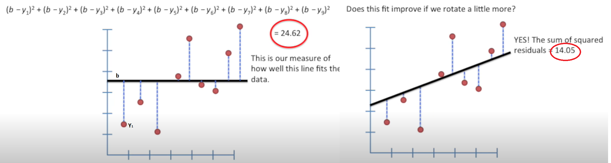

# ML Theorie

## Linear Regression and Linear Models

Linear Regression is a statistical approach in machine learning that predicts a continuous outcome based on the linear relationship between the dependent and independent variables.  
Linear Models, including Linear Regression, use a formula involving weighted input features to make predictions, offering simplicity and ease of interpretation.

`continuous outcome`: Numerical values that can take on any value within a range. House Prices, Temperature Forecasting, Stock Prices.  
`dependent variable`: A dependent variable is the outcome that is being measured and analyzed, typically influenced or predicted by one or more independent variables.  
`Independent variable`; 
Independent variables are the factors or inputs that are manipulated or observed to determine their effect on the dependent variable in an experiment or statistical analys.
 	
### The Main Ideas of Fitting a Line to Data

Fitting a line to data, commonly done in linear regression, involves finding the best linear relationship between the independent variables (predictors) and the dependent variable (outcome). The main idea is to determine a line that minimizes the difference (usually the sum of squared differences) between the observed values and the values predicted by the line. This process, known as least squares fitting, aims to produce a line that best represents the underlying trend in the data, allowing for prediction and interpretation of relationships between variables.

`residuals`: 
Residuals are the differences between the observed values and the values predicted by machine learning model.

The lower the sum of residuals the better our prediction line is.

